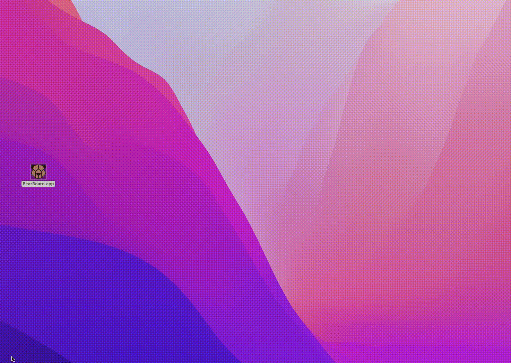
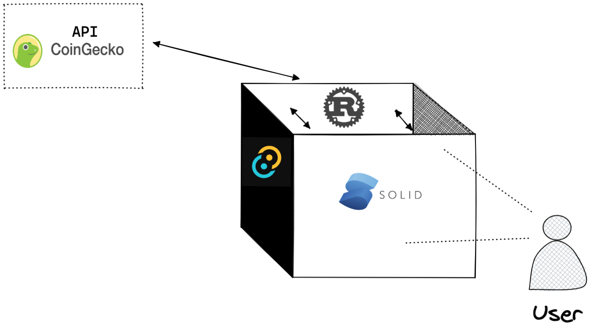

# BearBoard

## About the project

Bear Market - watch your favorite coins` price tank.

Simple dashboard showing crypto coins stats.

Project built with Tauri Studio (toolkit for building cross-platform desktop apps). A side project to learn new technologies, mainly Rust and SolidJS.

---

## Features:

- Open app, display pre-defined tokens general information (price, 24h change, name)

  

---

## Initial architecture showing how particular pieces fit together

## Tech:

- Tauri [website](https://tauri.studio/)
- Rust [website](https://www.rust-lang.org/)
- SolidJS [website](https://www.solidjs.com/)
- WindiCSS (TailwindCss) [website](https://windicss.org/)

## API:

- [CoinGecko API](https://www.coingecko.com/en/api/documentation)

---

## How to run project locally

install dependencies using `pnpm / npm`:

- `pnpm install`

run the app

- `npx tauri dev`

---

## Icons:

## Memes:

